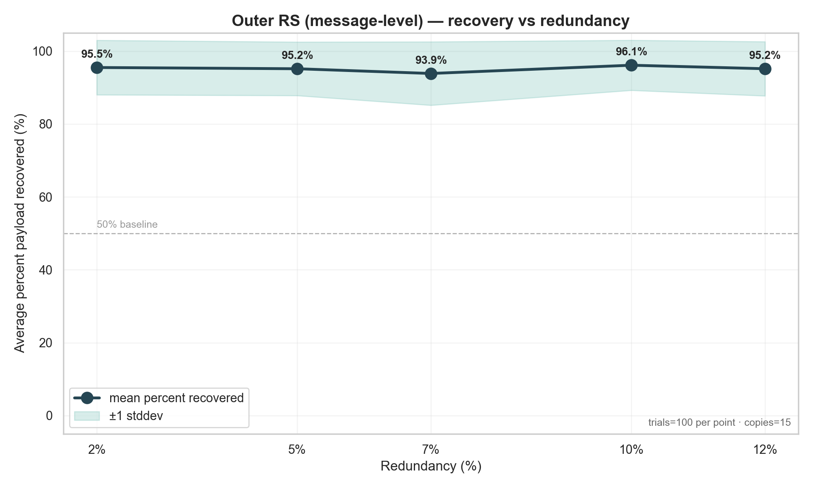

# rs-dna-pipeline ✨

Compact, modular Reed–Solomon pipelines and reproducible benchmarks for DNA data storage experiments.
Pure Python 3.9+ — quick to run, easy to extend.


## Features (v0.2.0 – December 2025)

- Reed–Solomon encoder/decoder over GF(256) – interpolation-based erasure recovery
- Automatic (k,n) recommendation for given oligo length and overhead (`pretty_recommendation`)
- Fully pluggable pipeline: Input → Encoder → Mapper → Channel → Aligner → Decoder → Output
- Simple global aligner + per-oligo consensus
- Channel models: substitution, insertion, deletion, coverage dropout
- Safety checks: warns when RS block size exceeds available oligo payload

## Quick start

Clone, create a virtualenv, install, and run the example (copy/paste):

```bash
git clone https://github.com/feeka/dna-storage.git
cd dna-storage
# create & activate a venv called .venv (recommended)
source .venv/bin/activate
python3 -m dna_storage.examples.basic_rs_pipeline
```

## As an experiment what is done here (short)
The setup runs a set based on [this paper](https://doi.org/10.1002/anie.201411378), message-level Reed–Solomon experiments that
measure average payload recovery across different outer-RS redundancy levels.
Outputs are collected in `bench_rs.csv`. Representative visualizations below.

-- Full (long) experiment (default):


Very short — likely causes for low recovery

- deletions shift symbol packing → erasures
- RS decoder is erasure-only (no substitution correction)
- low coverage or too-small parity makes recovery fragile

## Benchmarks

This repository includes example benchmarking scripts and plotting utilities under `examples/` that produce reproducible CSV and PNG artifacts (e.g. `bench_rs.csv`, `bench_rs.png`).

Experiment: controlled IDS-error experiment (staple behaviour)
-----------------------------------------------------

A reproducible experiment that runs a series of total per-base error levels (substitutions + deletions)
across a fixed set of levels and measures average payload recovery using only message-level (outer) Reed–Solomon is included.

- Toy experiment (quick example — matches current bench_rs.csv)

- Error total S values: 0.02 → 0.10 in steps of 0.02 (0.02, 0.04, 0.06, 0.08, 0.10)
	- NOTE: S is the per-base IDS error fraction (S = sub_p + del_p); plots show S on the x-axis as a percentage (S * 100). IDSChannel simulates substitutions + deletions.
- Trials per S: 10 (fast sample for debugging and figure previews)
- Payload length per trial L: fixed at 500 bytes
- Error split rule: sub_p ∈ [0.2*S, 0.8*S] selected per-trial; del_p = S - sub_p
- Coverage (copies): 60 reads per oligo (current run)
- RS redundancy used: 0.15 (15%)
- Pipeline behaviour: exactly the `basic_rs_pipeline` flow (Reed–Solomon encoder/decoder, rotating mapper, SoupDuplicator, IDSChannel, SimpleAligner)

Notes:
- The script uses the constrained split so each trial preserves the requested total error S but varies the ratio of deletion vs substitution.
- The aligner produces a single per-oligo consensus which may be shorter than the original codeword when deletions occur; those missing positions reduce the number of available codeword evaluations and can cause the RS decoder to be unable to reconstruct the message (the current RS decoder requires >= k correct byte-evaluations per block).
- Results are written to `bench_rs.csv` and plotted with the existing plotting scripts.

To run the full (long) experiment (defaults):

```bash
python3 examples/benchmark_rs.py    # runs the S series with defaults (100 trials × 10 S values)
```

You can override parameters on the CLI — see header of `examples/benchmark_rs.py` for syntax.

## Directory layout

High-level structure (top-level package + helpers and example pipelines):

- dna_storage/ (main package)
	- core/ — pipeline runner and abstract interfaces
	- components/ — encoders, mappers, channels, aligners, decoders, etc.
	- utils/ — GF(4)/GF(256) helpers and oligo utilities
	- examples/ — working end-to-end pipelines, benchmark drivers, plot helpers
	- benchmarks/ — reproducible benchmark outputs and analysis artifacts

For a quick visual, here's the same tree in monospace:

```text
dna_storage/
├── core/         # pipeline runner and abstract interfaces
├── components/   # encoder, mapper, channel, aligner, decoder, …
├── utils/        # GF(4)/GF(256) helpers, oligo utilities
├── examples/     # working end-to-end pipelines and bench scripts
└── benchmarks/   # reproducible benchmark outputs & analysis
```

## Usage

See `dna_storage/examples/basic_rs_pipeline.py` for a complete working example.

Mini usage (benchmarks & plotting)

Quick test & full (long) experiment

- Smoke test (fast, sanity-check; outputs bench_rs.csv):

```bash
# 3 trials per S, single redundancy=15%, copies=20, payload fixed at 500, S=0.02,0.04,0.06
python3 examples/benchmark_rs.py 3 0.15 20 500 500 0.02:0.06:0.02
```

-- Full (long) experiment (default):

```bash
# runs trials=100, redundancy=0.15, copies=20, payloads=500..700, S=0.02..0.20
python3 examples/benchmark_rs.py
```

- Generate the pretty recovery plot (redundancy on x-axis):

```bash
python3 examples/plot_recovery_pretty.py bench_rs.csv
```

- Generate recovery vs total-IDS-error plot (S on x-axis):

```bash
python3 examples/plot_recovery_vs_error.py bench_rs.csv
```

-- Parse the run log (or per-redundancy CSV) and produce the successes bar chart:

```bash
python3 examples/plot_successes.py successes
```


## Citation

If you use this code in published work, please cite the repository URL and add an entry appropriate to your citation style.

## License

MIT – see LICENSE

Issues and pull requests welcome.